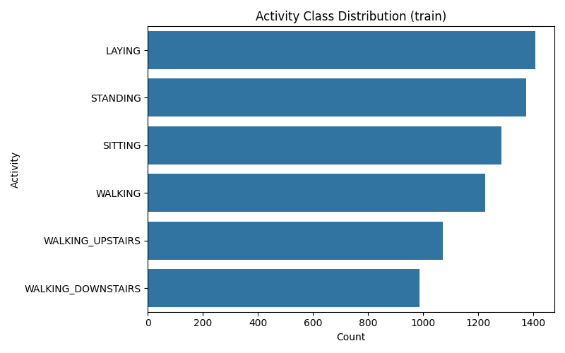
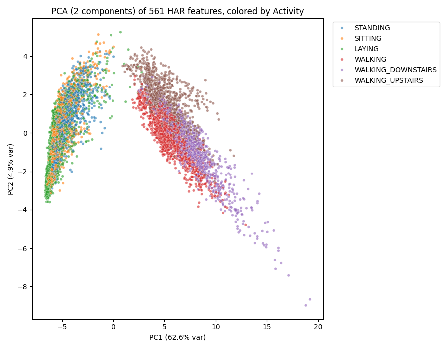

# Human Activity Recognition (HAR) with Neural Networks & Classical ML

[](https://www.python.org/)
[](https://pytorch.org/)
[](https://scikit-learn.org/)
[](#benchmark-results)

A comprehensive machine learning and deep learning investigation for **Human Activity Recognition (HAR)** using smartphone accelerometer and gyroscope data. The project systematically progresses from baseline decision trees and support vector machines to deep neural networks, diagnosing critical real-world phenomena such as subject-level data leakage, individual gait variance, and test-time domain shift, culminating in a champion **Diverse Architecture Ensemble** achieving **0.96879 Macro F1**.

---

## Table of Contents
1. [Project Overview & Dataset](#project-overview--dataset)
2. [Benchmark Results](#benchmark-results)
3. [Key Engineering & Methodological Breakthroughs](#key-engineering--methodological-breakthroughs)
4. [Repository Structure](#repository-structure)
5. [Getting Started & Reproduction](#getting-started--reproduction)
6. [Experimental Journey & Viva Summary](#experimental-journey--viva-summary)

---

## Project Overview & Dataset

The objective is to classify 6 physical human activities from smartphone sensor data:
- **Walking**
- **Walking Upstairs**
- **Walking Downstairs**
- **Sitting**
- **Standing**
- **Laying**

Data consists of 561 hand-crafted time- and frequency-domain features captured from 30 human subjects carrying a waist-mounted Samsung Galaxy S II smartphone.



---

## Benchmark Results

| Model / Strategy | Validation Strategy | Macro F1 | Test / Leaderboard F1 | Notes |
| :--- | :--- | :---: | :---: | :--- |
| **Decision Tree** | GroupKFold (5-fold) | 0.8697 | — | Depth=10, Entropy, min_leaf=5 |
| **Support Vector Machine (SVM)** | GroupKFold (5-fold) | 0.9581 | — | Unscaled, RBF kernel, C=10 |
| **Baseline MLP (PyTorch)** | Single Split (80/20) | 0.9765 | 0.95039 | Lucky single subject draw (overly optimistic) |
| **Baseline MLP (PyTorch)** | GroupKFold (5-fold) | 0.9386 ± 0.0426 | 0.95039 | Realistic subject-disjoint CV estimate |
| **MLP + 5-Seed Ensemble** | GroupKFold (5-fold) | 0.9412 | 0.95701 | Reduces weight initialization variance |
| **MLP + Per-Subject Normalization** | GroupKFold (5-fold) | **0.9731 ± 0.0176** | 0.96270 | Resolves Subject 14 bias (+88% error reduction) |
| **MLP + AdaBN (Domain Adaptation)**| GroupKFold (5-fold) | 0.9755 | 0.96566 | Recalibrates BatchNorm per test subject |
| **MLP + Label Smoothing (0.05)**   | GroupKFold (5-fold) | 0.9763 | 0.96813 | Softens ambiguous window-transition labels |
| **Diverse Architecture Ensemble** | GroupKFold (5-fold) | **0.9782** | **0.96879** | **Champion: 4 MLP architectures × 3 seeds (12 models)** |


---

## Key Engineering & Methodological Breakthroughs

### 1. Eliminating Subject Data Leakage (Foundational Decision)
- **The Pitfall**: Standard random `train_test_split` leaks an individual's data across both train and test splits. Because consecutive rows from the same person share device orientation, body mass, and gait, the model learns to identify *who* is moving rather than *what activity* is being performed.
- **The Solution**: Enforced strictly disjoint subject splits via `GroupShuffleSplit` and `GroupKFold` on the `subject` column (`train_subjects ∩ val_subjects = ∅`).

### 2. Deep Error Analysis & Per-Subject Normalization
- In cross-validation fold evaluation, one fold suffered a steep drop (F1 0.8856).
- Detailed error diagnosis revealed **Subject 14 alone caused 59% of all errors** (walking confused with walking upstairs) due to personal gait mechanics differing from global averages.
- **Breakthrough**: Implemented **Per-Subject Normalization** — standardizing features per subject using only their own mean and standard deviation (requires zero labels, applicable directly to test data). Subject 14 errors dropped by **88%**, and all 5 cross-validation folds showed dramatic improvement (mean 0.9386 → 0.9731, standard deviation cut by >50%).

### 3. PCA Dimensionality Reduction: Investigated & Rejected
- Explored 2-component (67.5% variance) and 65-component (95% variance) PCA reduction.
- Raw features consistently outperformed PCA across all models (Decision Tree: 0.87 raw vs 0.82 PCA; SVM: 0.96 raw vs 0.95 PCA). Axis-aligned trees and non-linear RBF kernels leverage original sensor axes better than rotated principal axes.



### 4. Sensor Contribution Study
- Dissected the 561 feature space into Accelerometer-derived (345) and Gyroscope-derived (213) features.
- Accelerometer-only achieved **0.9478 Macro F1**, excelling on static postures (LAYING, SITTING, STANDING).
- Gyroscope-only collapsed on static postures (F1 0.8143) but provided crucial discrimination during dynamic rotational movements.

### 5. Final Model: Diverse Architecture Ensemble
Rather than ensembling identical networks, the final pipeline ensembles **4 distinct MLP architectures** across 3 seeds (12 models total):
1. `[256, 128]` (Dropout 0.50)
2. `[512, 128]` (Dropout 0.45)
3. `[256, 256, 64]` (Dropout 0.40)
4. `[512, 256, 128]` (Dropout 0.40)

Combined with **Per-Subject Normalization** and **Label Smoothing (0.05)**, this ensemble delivered the project-best score of **0.96879**.


---

## Repository Structure

```text
├── final_model/                    # Final competition-winning scripts
│   ├── diverse.py                  # Champion Diverse Architecture Ensemble (Score: 0.96879)
│   ├── Final_model.py              # Standalone best NN training script
│   ├── Final_Sub.py                # 2-Phase training & submission pipeline
│   └── submission1.py              # Baseline SVM submission script
│
├── research/                       # Research, exploratory data analysis & diagnostics
│   ├── figures/                    # Plots, PCA charts, confusion matrices
│   ├── explore.py                  # Initial EDA & distributions
│   ├── splittest.py                # Subject leakage testing
│   ├── without_group.py            # Demonstration of leakage with random splits
│   ├── kabel_group.py              # Subject grouping validation
│   ├── PCA_classification.py       # PCA dimensionality reduction study
│   ├── sensor_compare.py           # Accelerometer vs Gyroscope study
│   ├── outlier.py                  # Transition window & outlier analysis
│   ├── diagnose.py                 # Error diagnosis: Subject 14 case study
│   ├── error_ckeck.py              # Cross-fold error breakdown
│   ├── sub_diagnose.py             # Subject-level diagnostic metrics
│   ├── sub_norm.py                 # Per-Subject Normalization breakthrough
│   └── seedtest.py                 # Seed variance & 5 vs 10 seed ensemble evaluation
│
├── testing/                        # Testing, verification & sanity checks
│   ├── test_verify.py              # Test dataset format verification
│   ├── verification.py             # Cross-validation verification pipeline
│   ├── verify_rawalign.py          # UCI HAR raw signal alignment check
│   ├── sub_check.py                # Submission structure sanity check
│   ├── Diff_check.py               # Compares predictions across submission files
│   ├── comparison.py               # Benchmark comparison script (DT vs SVM vs NN)
│   ├── best_epoch.py               # Optimal epoch count & early stopping tests
│   ├── best_hyperpara.py           # Hyperparameter tuning search
│   ├── rnn_fixedalpha.py           # Honest fixed-alpha blend validation
│   └── RNN_checks.py               # RNN architecture checks & signal inspection
│
├── models/                         # Baseline & experimental model architectures
│   ├── decision_tree.py            # Decision Tree baseline (GridSearchCV + GroupKFold)
│   ├── svm.py                      # Support Vector Machine (RBF kernel, C=10)
│   ├── xgboost_model.py            # Gradient Boosting baseline
│   ├── Raw_NN.py                   # PyTorch Baseline Feedforward NN
│   ├── feedforward.py              # Staged hyperparameter search pipeline
│   ├── largeMLP.py                 # Deep/wide MLP experiments with label smoothing
│   ├── improve.py                  # Architecture improvement variations
│   ├── improved1.py                # Extended regularized MLP
│   ├── onedCNN.py                  # 1D Convolutional Neural Network
│   ├── multi_cnn.py                # Multi-scale CNN with attention
│   ├── UCI.py                      # Raw UCI HAR dataset loader & preprocessing
│   ├── RNN_sub.py                  # LSTM / GRU recurrent model on raw inertial signals
│   ├── rnn_persub.py               # RNN with per-subject normalization
│   ├── blended_model.py            # Model blending experiments
│   ├── persub_model.py             # Per-subject normalized MLP
│   ├── persub_blended.py           # Per-subject blend
│   ├── groupfold_en.py             # GroupKFold-based ensemble
│   ├── adabn.py                    # Test-Time Domain Adaptation (AdaBN)
│   ├── adabn_sub.py                # AdaBN submission pipeline
│   ├── sub_training.py             # Subject-based training script
│   ├── new_model.py                # Margin cascade & physics feature model
│   └── advanced.py                 # Advanced regularized architectures
│
├── submissions/                    # Competition submission CSV files
│   ├── submission_diverse_ensemble.csv   # Current Best: 0.96879
│   ├── submission_margin_cascade.csv
│   ├── submission_label_smoothing.csv
│   └── ... (all intermediate competition submissions)
│
├── data/                           # Dataset storage
│   ├── train.csv                   # Labeled training dataset (7352 rows)
│   ├── test.csv                    # Unlabeled test dataset (2947 rows)
│   ├── sample_submission.csv       # Format template
│   └── UCI HAR Dataset/            # Raw inertial signal data (9 channels x 128 steps)
│
├── processed/                      # Checkpoints (.pt), preprocessed splits (.npy), scalers (.pkl)
├── projectFLOW.md                  # Comprehensive viva preparation & project chronology
├── requirements.txt                # Python package dependencies
└── .gitignore                      # Git ignore file
```

---

## Getting Started & Reproduction

### 1. Installation
Clone the repository and install dependencies:
```bash
git clone https://github.com/Yasas-Dewshan/Human_Activity_Recognition_NN.git
cd Human_Activity_Recognition_NN
pip install -r requirements.txt
```

### 2. Run the Champion Final Model
Train the 12-model Diverse Architecture Ensemble and produce `submission_diverse_ensemble.csv`:
```bash
python final_model/diverse.py
```

### 3. Run Baselines & Alternative Models
```bash
# Decision Tree Baseline
python models/decision_tree.py

# Support Vector Machine Baseline
python models/svm.py

# 1D CNN Model
python models/onedCNN.py
```

### 4. Run Research & Diagnostics
```bash
# Analyze Subject 14 failure case and per-subject normalization
python research/diagnose.py

# Evaluate Accelerometer vs Gyroscope contribution
python research/sensor_compare.py

# Check prediction differences between submissions
python testing/Diff_check.py
```

---

## Experimental Journey & Viva Summary

For an in-depth walkthrough of all 16 project phases, negative results, hyperparameter sweeps, and viva preparation Q&A, please refer to [`projectFLOW.md`](projectFLOW.md).
